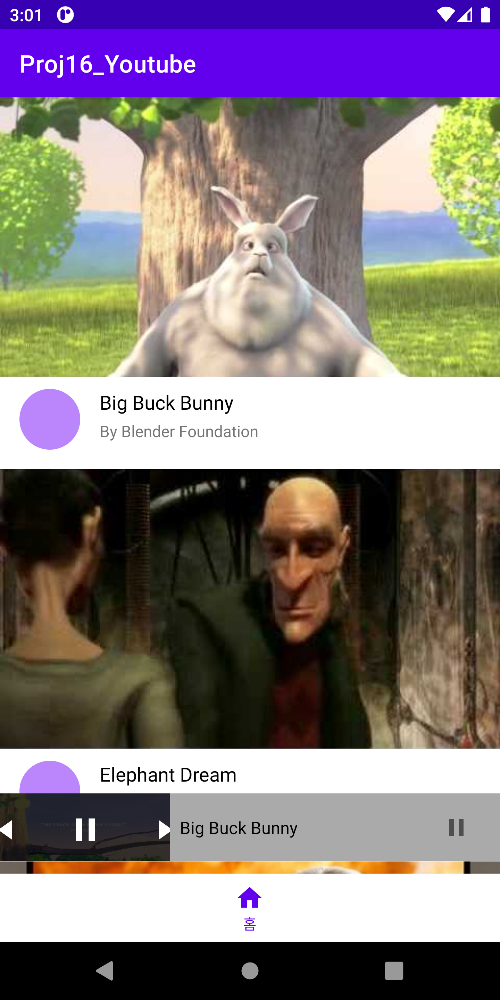
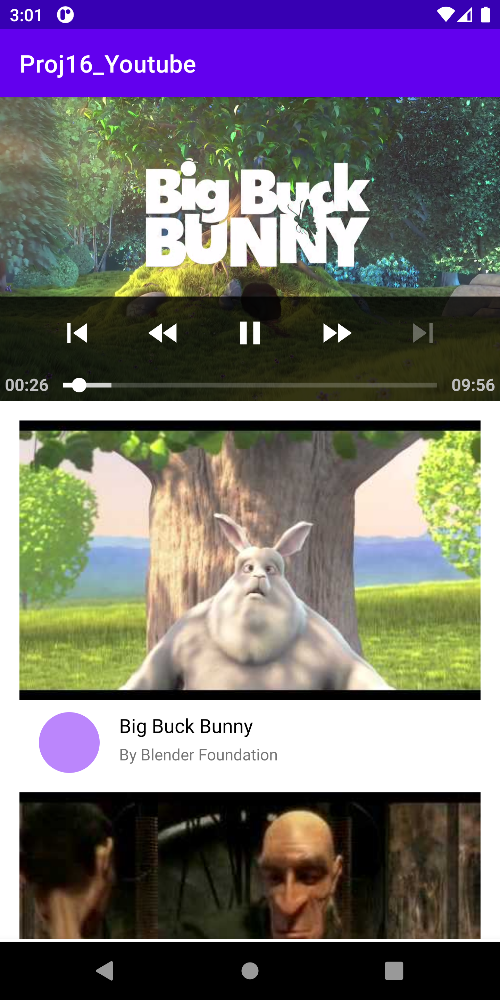

# Android Clone Coding Project #16 유튜브
Retrofit 을 이용하여 영상 목록을 받아와 구성함
 
MotionLayout 을 이용하여 유튜브 영상 플레이어 화면전환 애니메이션을 구현함.
 
영상 목록을 클릭하여 ExoPlayer 를 이용하여 영상을 재생할 수 있음.
 

# 결과화면
|Screenshot1|Screenshot2|
|---|---|
|||

 

# 배운 내용 정리
- **MotionLayout** 사용하기
- **Exoplayer** 사용하기

### MotionLayout

- ConstraintLayout 라이브러리의 일부 (서브 클래스)
- https://developer.android.com/training/constraint-layout/motionlayout/examples?hl=ko
- 레이아웃 전환과 UI 이동, 크기 조절 및 애니메이션에 사용
- 이기정님의 파트 4, 챕터 4, *OTT 앱 인트로 따라하기* 에서 더 자세히 후술

### ExoPlayer

- Google이 Android SDK 와 별도로 배포되는 오픈소스 프로젝트
- 오디오 및 동영상 재생 가능
- 오디오 및 동영상 재생 관련 강력한 기능들 포함
- 유튜브 앱에서 사용하는 라이브러리
- https://exoplayer.dev/hello-world.html
